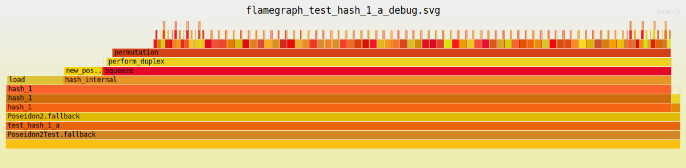

# forge-flamegraph

a foundry plugin that generates flamegraph for a specific test case. currently two backends are supported: calltrace and debugtrace.

## Installation

```bash
forge install zemse/forge-flamegraph
cd lib/forge-flamegraph
cargo install --path .
cd ../..
```

## Usage

### calltrace backend

this generates a flamegraph with the call trace. suitable for huge and complex contracts like defi protocols.

```bash
forge-flamegraph -t NAME_OF_TEST_FUNCTION
```

### `debugtrace` backend

this generates a flamegraph with internal functions and also displays SLOADs and SSTOREs. suitable for libraries.

```bash
forge-flamegraph -t NAME_OF_TEST_FUNCTION --debugtrace
```

example of a debugtrace flamegraph [poseidon2 hash function](https://github.com/zemse/poseidon2).



## Notes

the debugtrace backend is currently wip.
